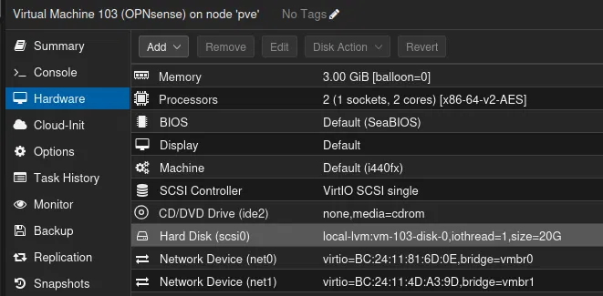
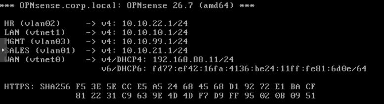
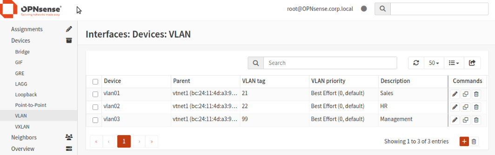
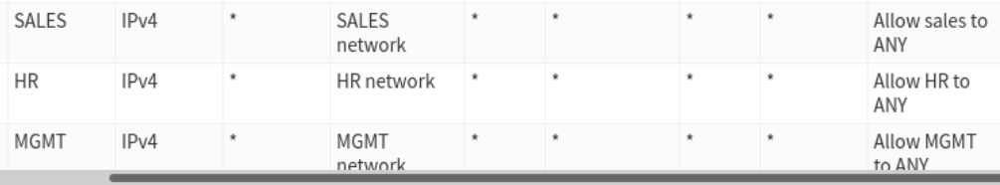
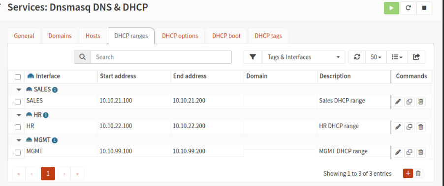
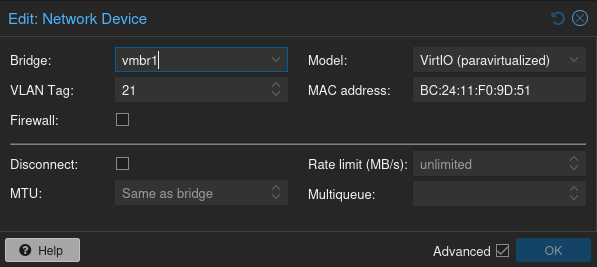
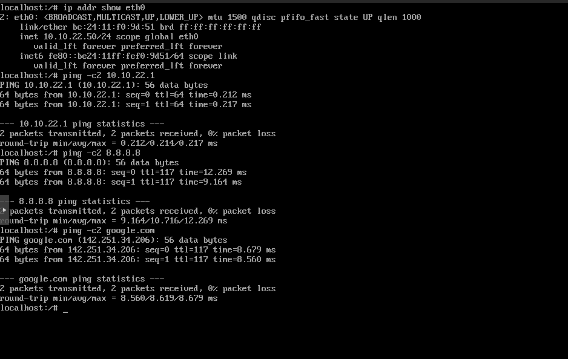
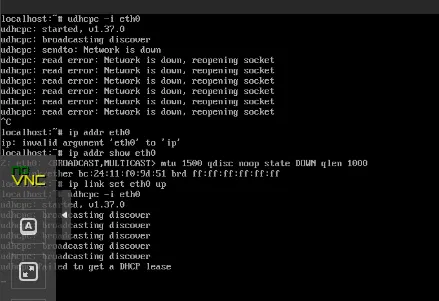
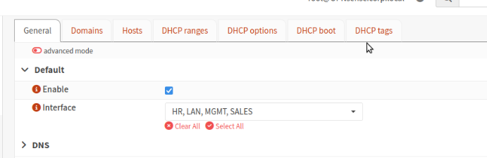
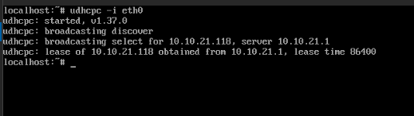

# Build Log

This document covers my first phase of the lab build, establishing the foundation of my virtual network utilizing Proxmox bridging, VLAN segmentation, and OPNsense as the router/firewall) before any of the AD components are deployed. I'll show case the steps taken along the way and issues I encountered. 

## Goal 

Setup a segmented lab network behind  a virtual firewall, with four VLANS:

| VLAN                 | Purpose                       | Subnet        |
| -------------------- | ----------------------------- | ------------- |
| 10 (native/untagged) | Root/HQ - future home of DC01 | 10.10.10.0/24 |
| 21                   | Sales                         | 10.10.21.0/24 |
| 22                   | HR                            | 10.10.22.0/24 |
| 99                   | Management                    | 10.10.99.0/24 |

## Steps taken

### 1. Proxmox network bridges

- Created `vmbr0` -  The outside bridge or WAN side, bridged to the physical NIC facing the home network. 
- Created `vmbr1` - The VLAN aware inside bridge with no physical NIC attached, a purely virtual bridge dedicated to the internal lab network. 
	- Rather than provisioning a separate bridge per VLAN, each VM's virtual NIC is tagged with its own VLAN ID, and all VMs share the one bridge. 
## 2. OPNsense VM deployment

 - Deployed OPNsense as a VM with two VirtIO NICs: one on `vmbr0` (WAN), one on `vmbr1` (LAN trunk).


- Installed via the console installer, assigned WAN/LAN interfaces by matching MAC addresses between Proxmox's Hardware tab and OPNsense's console-reported interface list.
- Configured LAN with a static IP (`10.10.10.1/24`), left WAN on DHCP so it can pull an address from the home router through vmbr0.
- Ran the OPNsense setup wizard: set domain to `corp.local` (matching the planned AD domain in advance), configured a placeholder public DNS server, and **disabled "Block RFC1918 Private Networks"** on WAN, since the lab's WAN interface receives a private address from the home router rather than a public IP, leaving this default security setting enabled would have blocked the lab's own internet access.


### 3. VLAN sub-interfaces in OPNsense

I spun up a Xubuntu VM set it's IP to `10.10.10.50/24` so I can access the OPNsense settings page at `10.10.10.1`.
- Created three VLAN sub-interfaces each parented to the LAN NIC (`vtnet1`): tag 21 (Sales), tag 22 (HR), tag 99 (Management).
- Assigned each as a new interface, enabled them, and set static IPs.



- Added baseline "pass any" firewall rules per VLAN interface, since OPNsense denies all traffic on new interfaces by default.



- Configured DHCP ranges per VLAN using OPNsense's Dnsmasq service.



### 4. Test client setup
- Built a lightweight Alpine Linux VM to serve as a disposable test client.
- Tested each VLAN by changing the Alpine VM's NIC VLAN tag in Proxmox and verifying: 
	- (1) can it reach the OPNsense gateway on that VLAN
	- (2) can it reach the internet by IP
	- (3) can it resolve DNS.




## Mistakes
I made two mistakes during my OPNSense setup that testing with the test client allowed me to fix.

1. I forgot to reboot  OPNsense

My initial test client wasn't given an IP after running dhcpc -i eth0. I decided to statically set everything up instead, but was still unable to ping 10.10.21.1 even with a correctly assigned VLAN 21 and a static IP of 10.10.21.50. After checking the logs, my pings were never being blocked, just not returning, so after reviewing the settings three times to make sure I'd set the subnet's IPs correctly, I decided to reboot. That worked!
```
ip addr add 10.10.XX.50/24 dev eth0
ip link set eth0 up
ip route add default via 10.10.XX.1
echo "nameserver 10.10.XX.1" > /etc/resolv.conf
```

After statically setting everything up again, I was able to ping the subnet's gateway and Google's DNS. Now I know the DHCP server had its own issue with assigning IPs, separate from needing to reboot OPNsense.



2. I never told Dnsmasq service to listen to my VLAN interfaces

I kept running `dhcpc -i eth0`  with no success and the DHCP ranges were correctly configured.



Leading me to the actual cause: Dnsmasq's general settings page has a separate "Interface" field controlling which interfaces the service actively listens on for requests, by default this only had LAN selected. 



The DHCP ranges existed, but Dnsmasq was never told to listen for requests arriving on the SALES/HR/MGMT interfaces at all, so broadcasts on those VLANs went completely unanswered. Resolved it by simply adding SALES, HR, and MGMT to the Interface selection and rebooting OPNsense.

 

## Key Takeaway

The most time consuming part of this phase wasn't the planning or setup, but the small things,  config changes I confidently thought were successful, typos, and unfulfilled settings. The firewall logs really helped me understand that traffic was never blocked, but simply never arrived, which led me to discovering the root problems.

The two most valuable lessons from this phase: first, when something that should work doesn't, isolate the variables rather than guessing. Switching to a fully manual static IP configuration on the test client ruled out more complicated issues like VLAN tagging, routing, or firewall rules in one go, and confirmed the problem was specifically DHCP rather than something else. Second, a working configuration screen and a working service are not the same thing, both the VLAN interface issue and the dnsmasq interface issue involved settings that were saved correctly in the OPNsense UI but didn't take effect until a reboot was performed.
### Resources
- [Proxmox Docs](https://pve.proxmox.com/pve-docs/)
	- [Proxmox VLAN docs](https://pve.proxmox.com/pve-docs/chapter-pvesdn.html#)
- [OPNsense](https://docs.opnsense.org/index.html)
	- [ Firewall rules](https://docs.opnsense.org/manual/firewall.html)
- [VLAN OPNsense ](https://www.youtube.com/watch?v=5MY5FhMjs94)
- Proxmox Training Series[Learn Linux TV](https://www.youtube.com/@LearnLinuxTV)
	- [Creating Templates](https://www.youtube.com/watch?v=t3Yv4OOYcLs&list=PLT98CRl2KxKHnlbYhtABg6cF50bYa8Ulo&index=8)