# Initial Setup: Windows Server 2025 VM in Proxmox

This document covers my initial setup of my Windows Server 2025 home lab, used to follow with *Windows Server 2025 Administration Fundamentals* by Bekim Dauti. Covers the Proxmox host prep, VM creation, Windows installation, and post-install configuration up through my first snapshot. 

##  Table of Contents
- [Host Environment](#host-environment)
- [VM Creation](#vm-creation)
- [Windows Server Installation](#windows-server-installation)
- [Post-Install Configuration](#post-install-configuration)
- [Snapshot: clean-base-ready](#snapshot-clean-base-ready)

## Host Environment 

**Hypervisor:** Proxmox VE 9.2.5 (bare metal, old gaming laptop repurposed as a server)

**Host hardware:**
```
root@pve:~# lshw -short 2>/dev/null | grep -Ei "processor|memory|disk|nvme|network|system|volume"

system         OMEN Laptop 15-ek0xxx (2A137UA#ABA)
/0/0                               memory         64KiB BIOS
/0/16                              memory         16GiB System Memory
/0/16/0                            memory         8GiB SODIMM DDR4 Synchronous 3200 MHz (0.3 ns)
/0/16/1                            memory         8GiB SODIMM DDR4 Synchronous 3200 MHz (0.3 ns)
/0/21                              memory         384KiB L1 cache
/0/22                              memory         1536KiB L2 cache
/0/23                              memory         12MiB L3 cache
/0/24                              processor      Intel(R) Core(TM) i7-10750H CPU @ 2.60GHz
/0/100                             bridge         10th Gen Core Processor Host Bridge/DRAM Registers
/0/100/14.2                        memory         RAM memory
/0/100/14.3        wlo1            network        Comet Lake PCH CNVi WiFi
/0/100/1b.4/0      /dev/nvme0      storage        CT1000P310SSD8
/0/100/1b.4/0/0    hwmon4          disk           NVMe disk
/0/100/1b.4/0/2    /dev/ng0n1      disk           NVMe disk
/0/100/1b.4/0/1    /dev/nvme0n1    disk           1TB NVMe disk
/0/100/1b.4/0/1/1  /dev/nvme0n1p1  volume         931GiB EXT4 volume
/0/100/1d/0        /dev/nvme1      storage        Samsung SSD 970 EVO Plus 500GB
/0/100/1d/0/0      hwmon3          disk           NVMe disk
/0/100/1d/0/2      /dev/ng1n1      disk           NVMe disk
/0/100/1d/0/1      /dev/nvme1n1    disk           500GB NVMe disk
/0/100/1d/0/1/1    /dev/nvme1n1p1  volume         1006KiB BIOS Boot partition
/0/100/1d/0/1/2    /dev/nvme1n1p2  volume         1023MiB Windows FAT volume
/0/100/1d/0/1/3    /dev/nvme1n1p3  volume         464GiB LVM Physical Volume
/0/100/1d.5/0      nic0            network        RTL8111/8168/8211/8411 PCI Express Gigabit Ethernet C
```

**Networking:** Host uses `vmbr0` as the primary Linux bridge, connecting the physical NIC to all VM virtual NICs, acting as a virtual switch so VMs appear as normal devices on the LAN.

**LAN details**:
```
root@pve:~# hostname -I
192.168.88.9 100.89.19.101 fd7a:115c:a1e0::8301:13bf 
```
 - Subnet: `192.168.88.0/24` 
- Gateway: `192.168.88.1` 
- Router DHCP pool: `192.168.88.2 – 192.168.88.249`
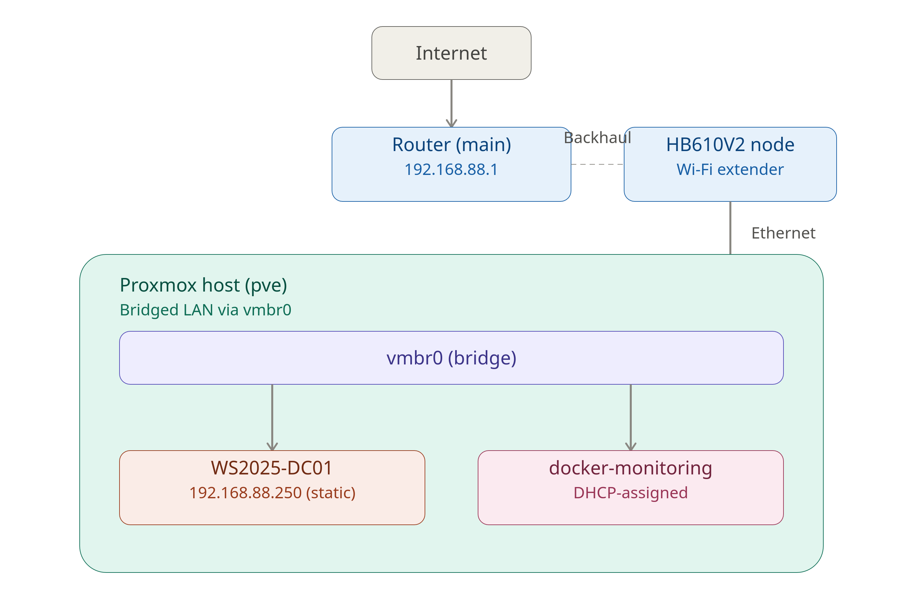
You might have some questions on this current iteration of my lab:

- Why is the Proxmox host wired into the node instead of the main router directly?

I have Ziply Fiber and the only location they could install it in is my room mate's closet across the apartment. Yes it does cause a bottle neck that I will address once I move out in the near future.

- What is docker-monitoring?

An Ubuntu Server VM running a Prometheus + Grafana + Nginx monitoring stack via Docker. It was an earlier project I started experimenting with when first installing Proxmox, but I shelved it to focus on the current lab. I'll pick it back up once the Windows Server lab is further along.

--- 
## VM Creation
**VM:** `WS2025-DC01` (VM ID 101) - Windows Server 2025 
*this is technically exercise 2.1 - Clean Installation*

Most fields were left at their defaults. The settings below are the ones that mattered
#### OS
- **Version:** `11/2022/2025` - Proxmox groups Server 2025 under this profile
- **VirtIO driver ISO** attached as a second CD/DVD drive, required during install, since Windows has no built-in VirtIO drivers
#### System
- **BIOS:** `OVMF (UEFI)`, required for modern Windows Server; enables Secure Boot and TPM
- **Machine:** `q35`, modern chipset (PCIe, USB3), pairs with UEFI
- **SCSI Controller:** `VirtIO SCSI single`, paravirtualized storage, far lower overhead than emulated IDE/SATA
- **Qemu Agent:** enabled, lets Proxmox report the guest's real IP and support clean shutdowns
#### Disks
- **Bus:** `SCSI` *(not default IDE)*, required to actually use the VirtIO SCSI controller above
- **Size:** `70 GB`, above Microsoft's 32GB minimum
#### CPU
- **Type:** `host`, passes through the physical CPU's full instruction set instead of a generic emulated profile
- **Cores:** `4` *(of 12 host threads)*, leaves headroom for the host and other VMs
#### Memory
- **Allocation:** `8192 MB`, comfortable for AD DS/DNS/GUI workloads without starving the host
#### Network
- **Model:** `VirtIO` *(not default Intel E1000)*,  paravirtualized NIC, lower CPU overhead and higher throughput
## Windows Server Installation
1. Booted VM, selected the Windows Server ISO from the UEFI boot device menu (two DVD-ROM entries appear, one is the OS installer, one is the VirtIO driver ISO)
2. Language/time/keyboard: left at defaults
3. Edition selected: **Windows Server 2025 Standard Evaluation (Desktop Experience)**
   - Desktop Experience chosen over Server Core to support GUI-based administration, matching how the book's exercises are presented
   - Standard (not Datacenter) is sufficient for lab purposes, Datacenter's extra features (unlimited virtualization rights, Storage Spaces Direct) aren't needed here
4. Installation type: **Custom: Install Windows only (advanced)**
5. Disk selection: initially **no disk appeared**,  resolved by clicking **Load driver** and browsing to:
```
   [VirtIO ISO] \ vioscsi \ 2k22 (or 2k25) \ amd64
```

After loading the "Red Hat VirtIO SCSI controller" driver, the 70GB disk appeared and installation proceeded normally.
7. Set local Administrator password
8. Installation completed, server rebooted into Server Manager

*Saving Exercise 2.2 and 2.3 for later*
 
## Post-Install Configuration
 
### 1. Install VirtIO guest tools
Ran `virtio-win-guest-tools.exe` from the VirtIO ISO drive via File Explorer. This installs:
- Network driver (NetKVM), required for any network connectivity at all
- QEMU Guest Agent,  enables Proxmox to report the VM's real IP and support graceful shutdowns
- Balloon driver, supports memory ballooning
### 2. Rename the computer
Renamed to `DC01`, ahead of eventual domain promotion
(renaming after joining a domain is more involved).
 
### 3. Configure static IP
Domain controllers require a stable, unchanging IP, so this was set before proceeding further into the book.

Chose `192.168.88.250`,  just outside the upper bound of the DHCP pool, guaranteeing no conflict 

IPv4 Properties:

| Field           | Value                               |
| --------------- | ----------------------------------- |
| IP address      | `192.168.88.250`                    |
| Subnet mask     | `255.255.255.0`                     |
| Default gateway | `192.168.88.1`                      |
| Preferred DNS   | `192.168.88.1` (router — temporary) |
| Alternate DNS   | `8.8.8.8` (fallback)                |

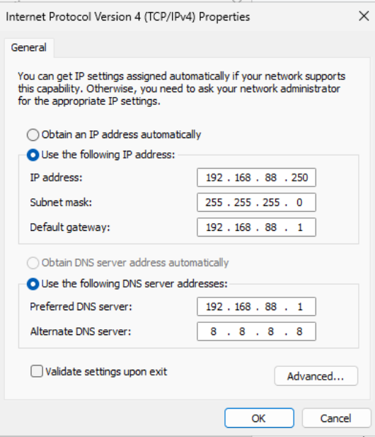
 
> Note: Preferred DNS will be changed to `127.0.0.1` once AD DS + DNS roles are installed in the next stage, since the server will become authoritative for its own domain's name resolution at that point.
 
Verified with:
```powershell
ipconfig /all
ping 192.168.88.1
ping 8.8.8.8
```
 
### 4. Windows Update
Ran Windows Update to bring the fresh install current before proceeding with any book exercises.
### 5. Resource usage check
Post-setup, confirmed the VM was comfortably within its allocated resources:
- CPU usage: ~2% of 4 vCPUs
- Memory usage: ~1.2 GB of 8 GB allocated
 
---
 
## Snapshot: clean-base-ready
 
Once renamed, statically addressed, and updated, a Proxmox snapshot was taken as a rollback point before beginning any book chapters:
 
**Snapshots -> Take Snapshot -> name: `clean-base-ready`**
 
This provides a safe restore point in case later exercises (AD DS promotion, GPOs, role installs) need to be redone from a known-good state.

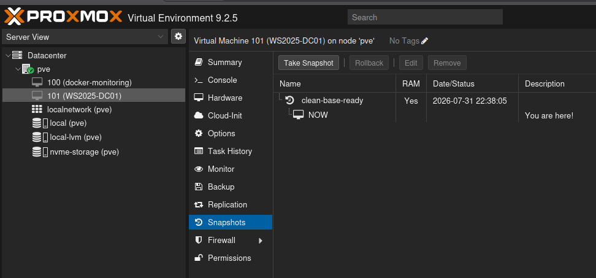
 
---
## Initial Mistake: Attempting to Join a Domain That Didn't Exist

Before installing the AD DS role, an attempt was made to **join** `david.local` as a domain, both via `sconfig` and GUI

Both attempts failed with:
```
An Active Directory Domain Controller (AD DC) for the domain "david.local"
could not be contacted.
```

**Root cause:** `david.local` didn't exist yet as an AD domain anywhere on the network, there was no domain controller to contact. "Joining" a domain assumes the domain already exists; a server doesn't join a domain to become its first domain controller. Instead, promotion is the process that creates the domain in the first place.
## Installing the AD DS Role
 
1. **Server Manager -> Manage -> Add Roles and Features**
2. **Installation Type:** Role-based or feature-based installation
3. **Server Selection:** `WinSrv2025-DC01` (192.168.88.250) 

4. **Server Roles:** checked **Active Directory Domain Services**
   - Prompted to add required management tools -> **Add Features**
5. **Features:** left at defaults
6. **Confirmation -> Install**

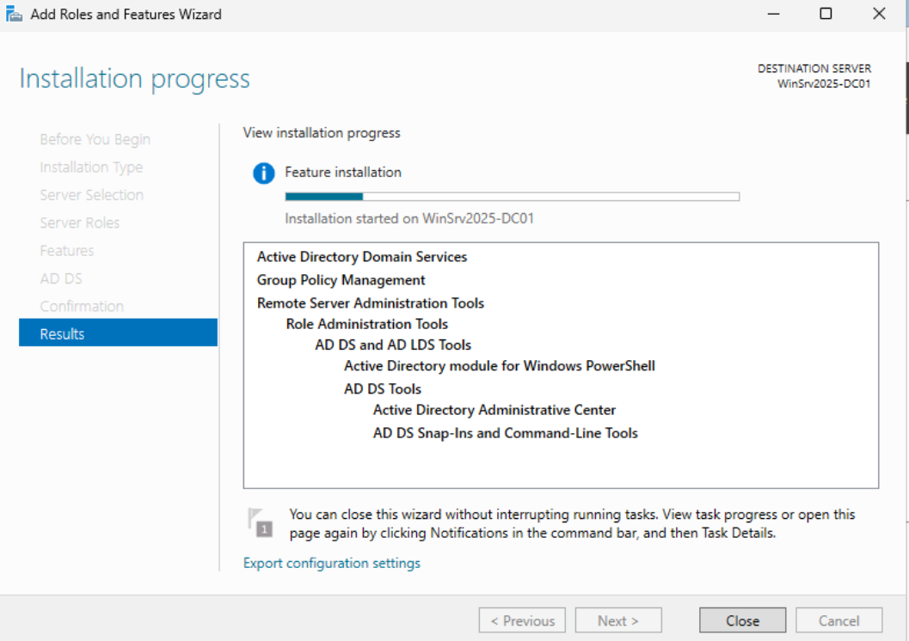
> After installation completed, the Server Manager dashboard still showed **"Roles: 0"** and no AD DS/DNS entries in the sidebar. This was resolved with a manual refresh, the install had actually succeeded, the dashboard just hadn't refreshed automatically.

**Verified the role was actually installed via PowerShell:**
```powershell
Get-WindowsFeature -Name AD-Domain-Services, DNS
```


--- 
## Promoting the Server to a Domain Controller
 
Triggered via the notification flag in Server Manager -> **"Promote this server to a domain controller."**
 
| Wizard page               | Setting                                                                     |
| ------------------------- | --------------------------------------------------------------------------- |
| Deployment Configuration  | **Add a new forest**, root domain name: `david.local`                       |
| Domain Controller Options | DNS server: checked (installs DNS alongside AD DS); DSRM password set       |
| DNS Options               | Delegation warning ignored, expected in a lab with no parent DNS zone       |
| Additional Options        | NetBIOS name auto-filled: `DAVID`                                           |
| Paths                     | Left at default (database, log files, SYSVOL)                               |
| Review Options            | Confirmed all settings                                                      |
| Prerequisites Check       | Yellow warnings present but no blocking errors — proceeded with **Install** |

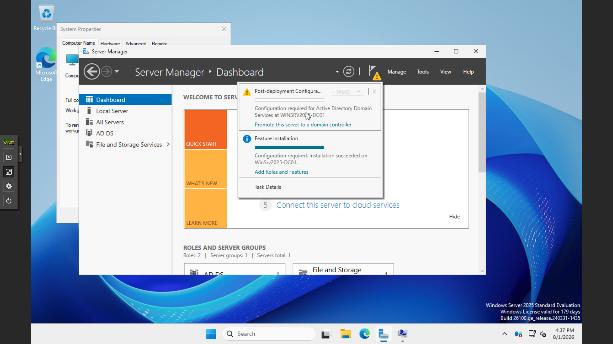

The server rebooted automatically once promotion completed.
## Post-Promotion Verification
 
Confirmed the domain is live:
```powershell
Get-ADDomain
```

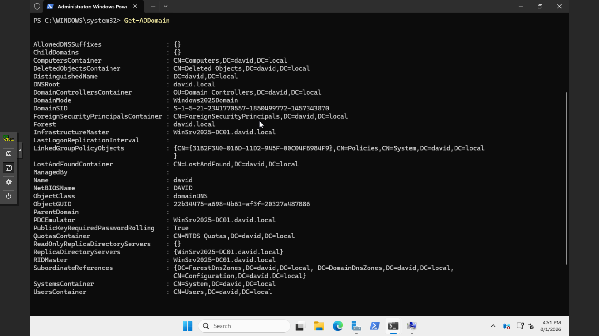

## Snapshot: ad-ds-promoted

 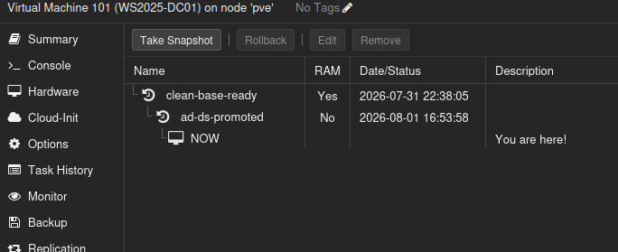

---

# Creating VM Windows 11 Template

Same setup as the Windows Server

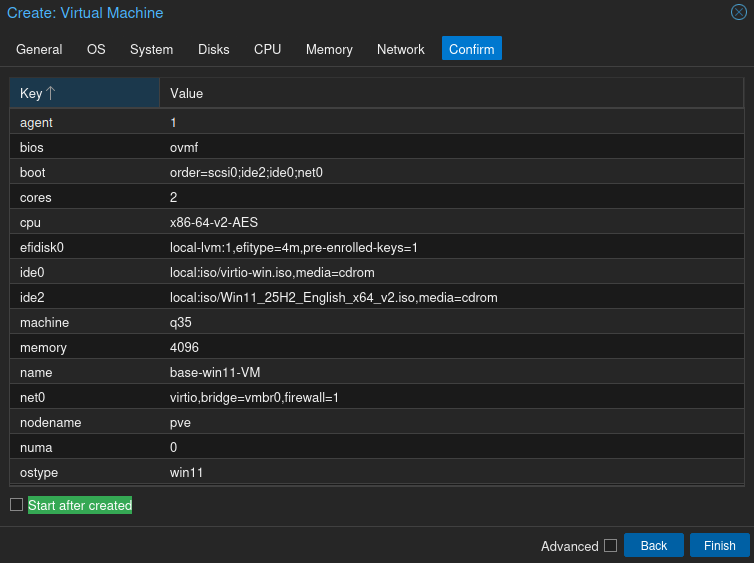

- Installed VirtIO drivers, could not run the driver installer directly, and no internet bypass was available to create a local account or run the drivers through the normal OOBE flow. 

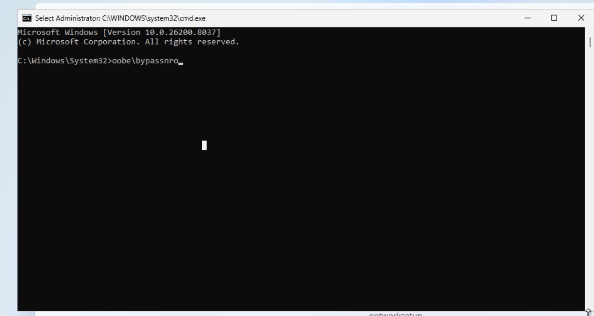
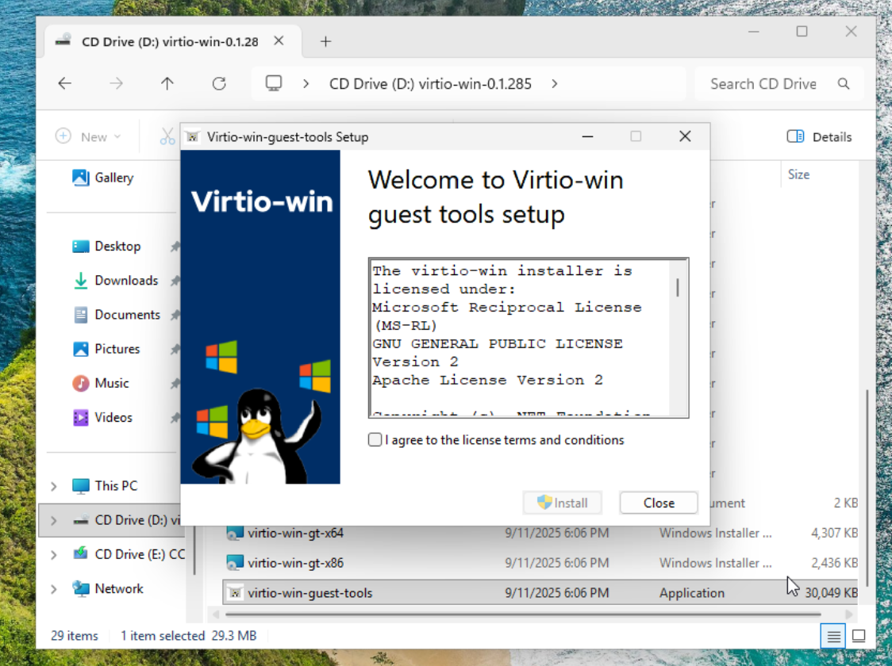

 - Ran Windows Update, applied a quick round of updates before sysprepping.

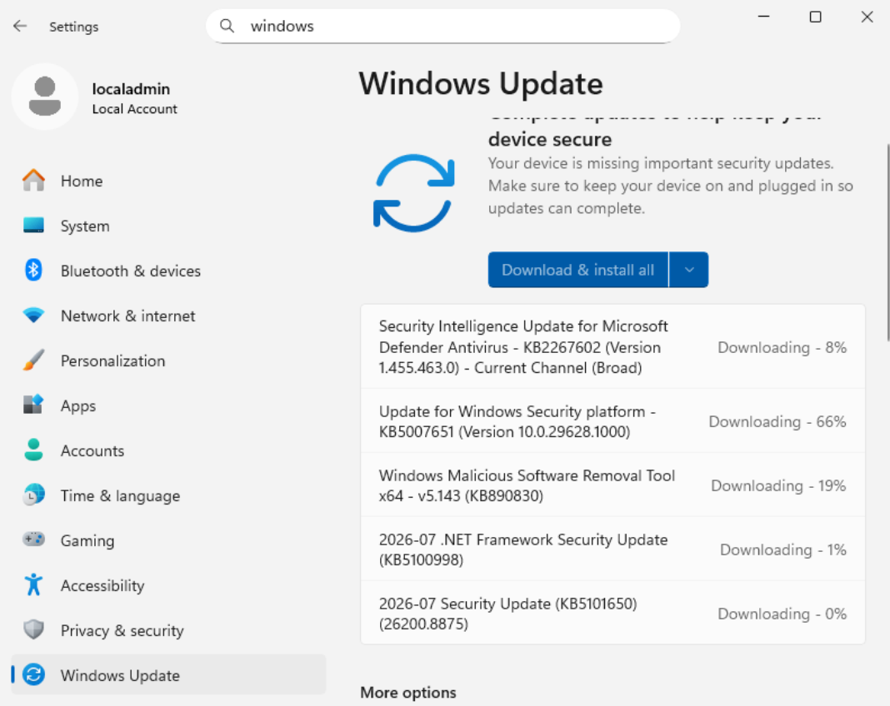
### Sysprep failed: "was not able to validate your Windows installation"

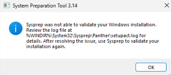
- Log (`C:\Windows\System32\Sysprep\Panther\setupact.log`) showed `BitLocker is on for the OS volume`. Windows 11 silently auto-enables **Device Encryption** during setup once TPM 2.0 + Secure Boot are both present.

- Turned bit locker off with `manage-bde -off C:` and `manage-bde -status C:` for more accurate progress.

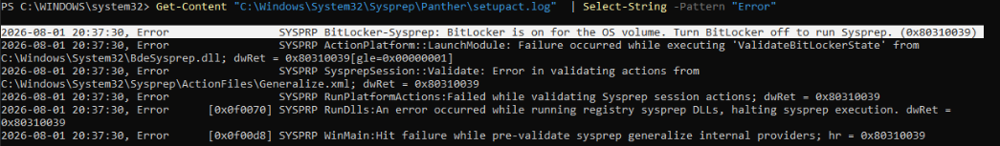

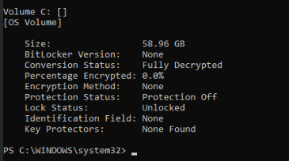
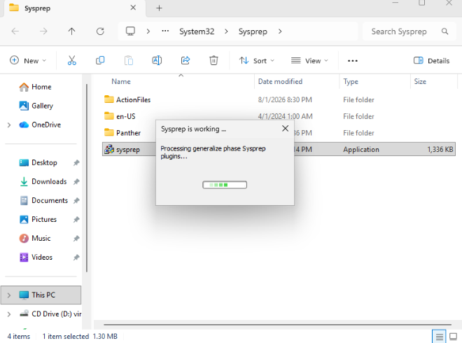

### Windows 11 Template Complete

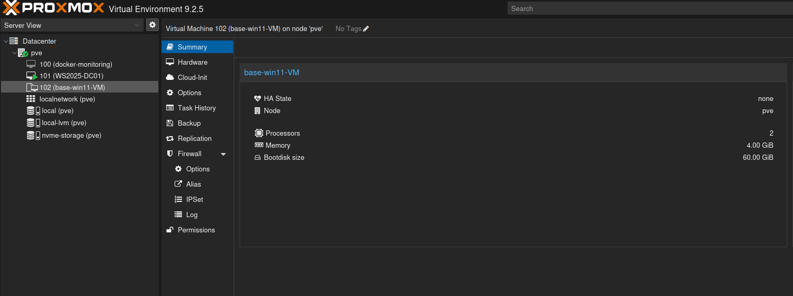